# tt-scout

[](https://github.com/Pai-88/tt-scout/actions/workflows/tests.yml)

Table tennis match analysis from one phone on a tripod. Film a match from the side of the table, and tt-scout finds every point
and who won it, keeps score in games to 11, measures each shot's speed in 3D with its own error bar, and measures each player's
posture at every hit. The result is one report per match, with a clip of every point and the whole match as one video, plus a
profile page per player across matches. Everything runs offline on your own machine, and nothing is uploaded.

<p align="center">
  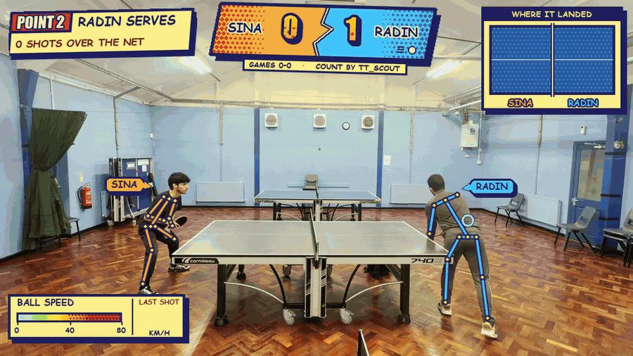
</p>
<p align="center"><sub>One point from our own recordings, filmed on a phone at the side of the table: both skeletons, the ball's
trail, the score tt-scout keeps, where each shot landed and its speed, then the panel that marks how the point ended. See the
<a href="https://paingheinhtet.com/tt-scout/report.html">example report</a>, with a clip of every point.</sub></p>

## How it works

1. **The table is the calibration.** A table is exactly 2.74 x 1.525 m, so its four corners are enough to recover where the
   phone stood and its focal length (OpenCV `solvePnP`, scanning the focal length). No checkerboard is needed, and every
   measurement comes out in metres. The corners are found automatically: blue and green tables by colour; any other table by
   growing its surface out from the middle of the picture until it stops at the white edge line, then snapping to that line
   (`tt_scout/tablefind.py`).

   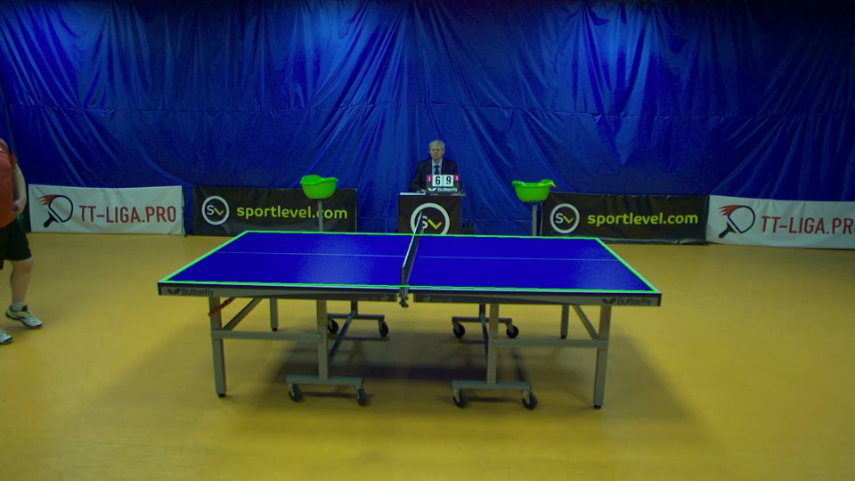

2. **Ball tracking** is classical: background subtraction plus a constant-velocity tracker (`detector.py`, `tracker.py`). It
   runs on a laptop, and when it goes wrong you can find the exact frame and see why. A learned detector can run beside it
   (see [below](#the-learned-ball-detector)).
3. **Events and points.** Bounces, racket hits and net crossings come from kinks in the ball's path. A small state machine
   turns them into points, the server and the winner (`events.py`, `points_v1.py`, `scoring.py`). A clip only celebrates an
   ending it actually saw: the ball followed down to the floor, into the net, or onto a second bounce.

   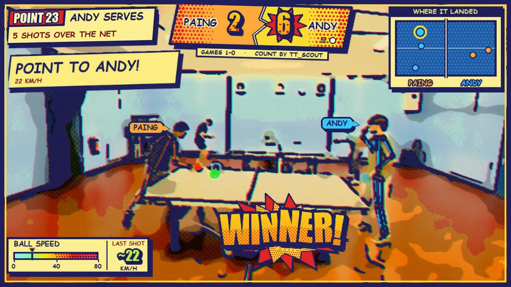

4. **Speed from physics, not pixels.** One camera cannot see depth: a fast ball far away looks like a slow ball close up. A
   bounce has to happen on the table, which pins that moment in 3D, so each shot's flight is fitted in 3D through the calibrated
   camera, with gravity, air drag and spin, anchored where the ball bounced (Levenberg-Marquardt, `flight.py`). A speed is only
   counted when the hit was actually seen, and every measured shot carries its own error bar.

   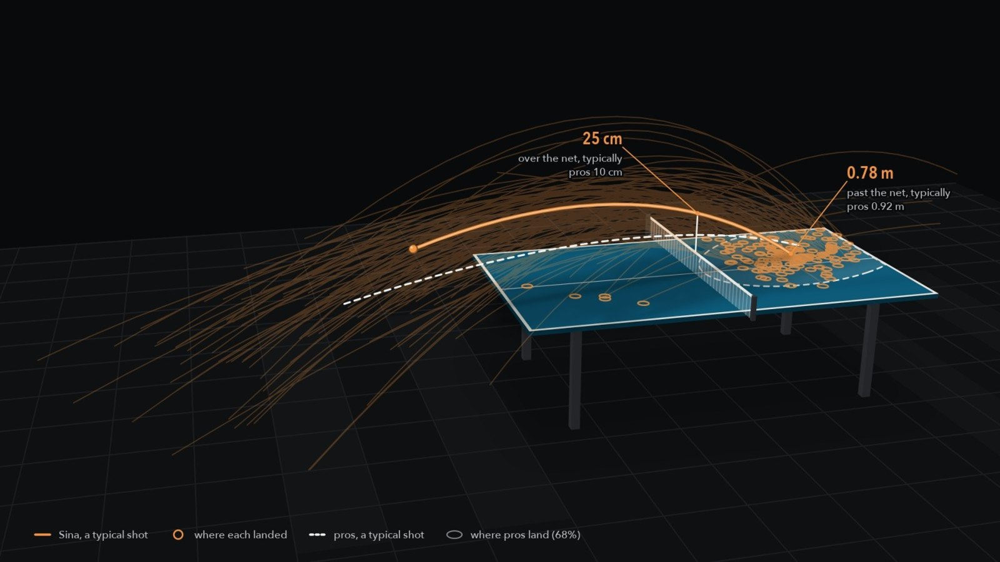

5. **Bodies.** Apple's Vision framework gives 2D and 3D skeletons (`tools/pose`, `tools/pose3d`, macOS only). They are placed
   on the table with the same camera model: an ankle projected onto the floor says where a player stood, and the 3D body gives
   trunk lean and shoulder turn. Knee bend is read in the picture from the leg nearer the camera, only when the hips are turned
   enough to show it. All of these are compared with professional players measured the same way on the OpenTTGames matches.

   <table>
     <tr>
       <td width="50%">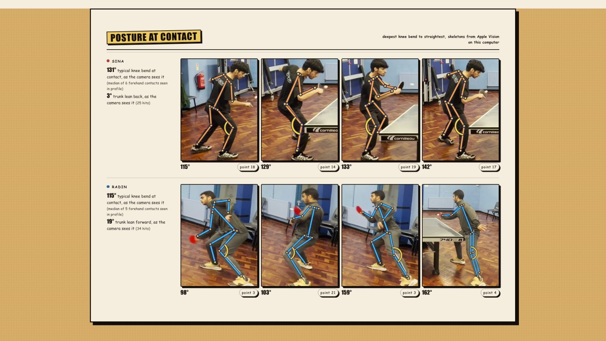<br><sub>Posture at contact, deepest knee bend to straightest.</sub></td>
       <td width="50%">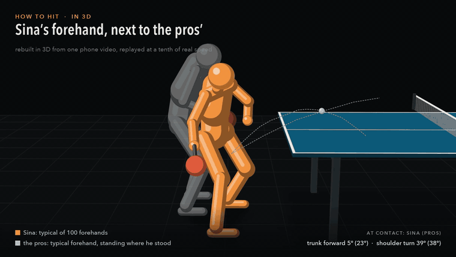<br><sub>A typical forehand in 3D (orange) next to a professional's (grey).</sub></td>
     </tr>
     <tr>
       <td>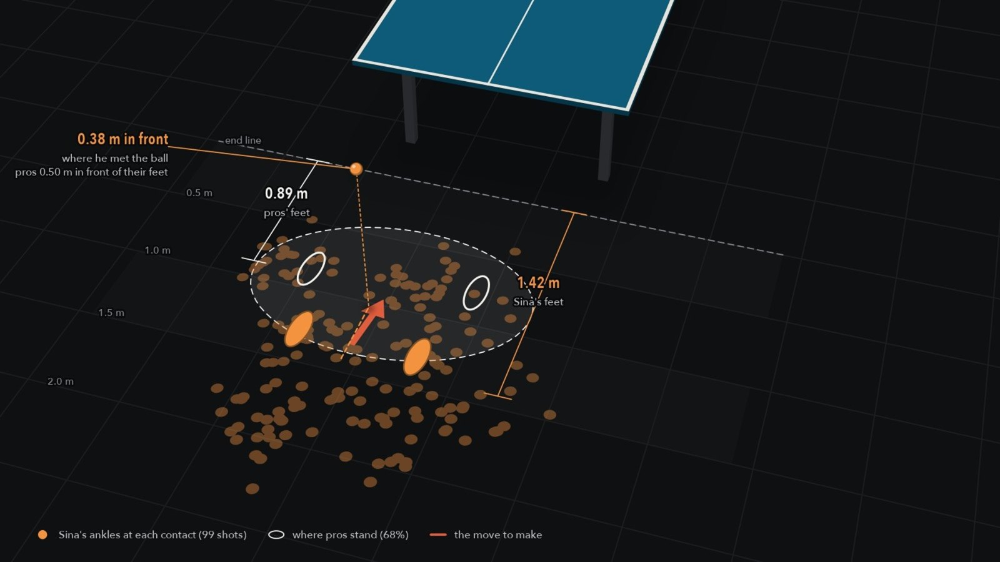<br><sub>Where the feet were at each contact, against where professionals stand.</sub></td>
       <td>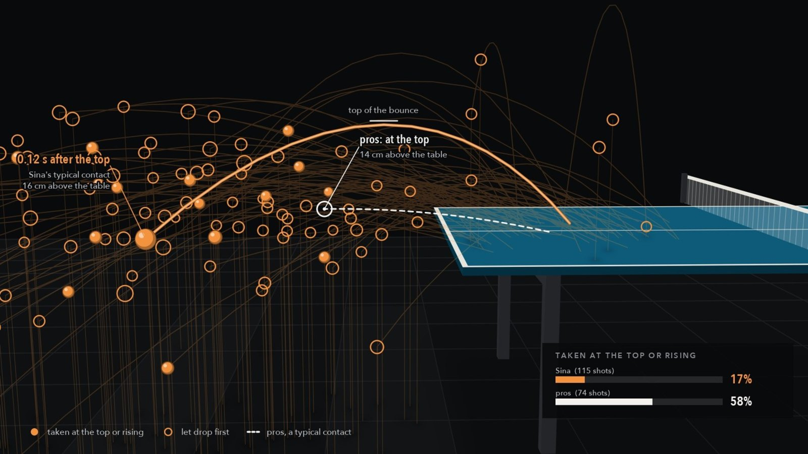<br><sub>Where on the bounce each shot was taken: at the top, or after it drops.</sub></td>
     </tr>
   </table>

## What you get

Each match becomes a report (score, a verdict on how far the automatic count can be trusted, a clip of every point, match
stats, placement, momentum, coaching notes and the 3D plates above), and every player gets a card and a profile that grows
with each recording.

<table>
  <tr>
    <td width="50%">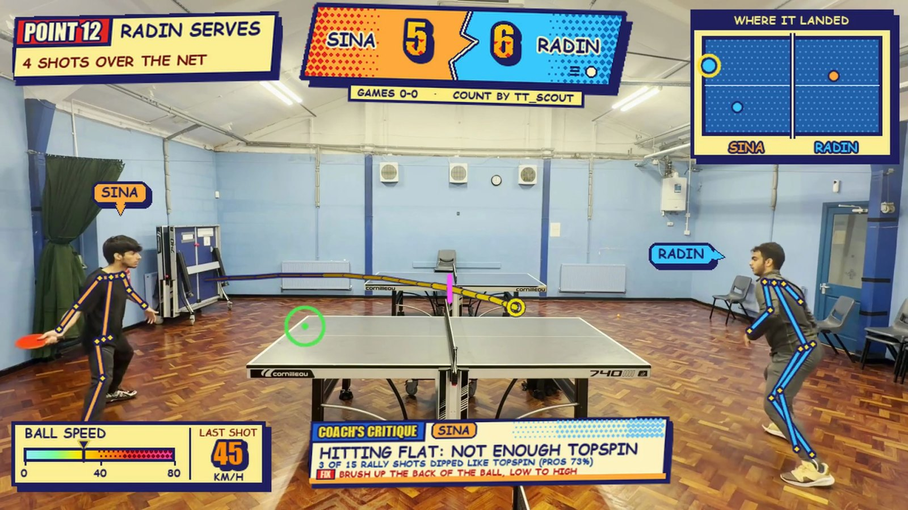<br><sub>A clip as it plays.</sub></td>
    <td width="50%">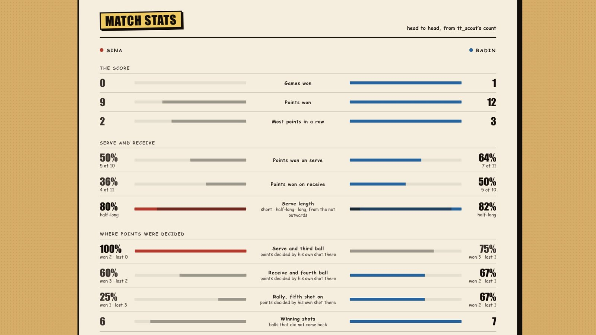<br><sub>Match stats, head to head.</sub></td>
  </tr>
  <tr>
    <td>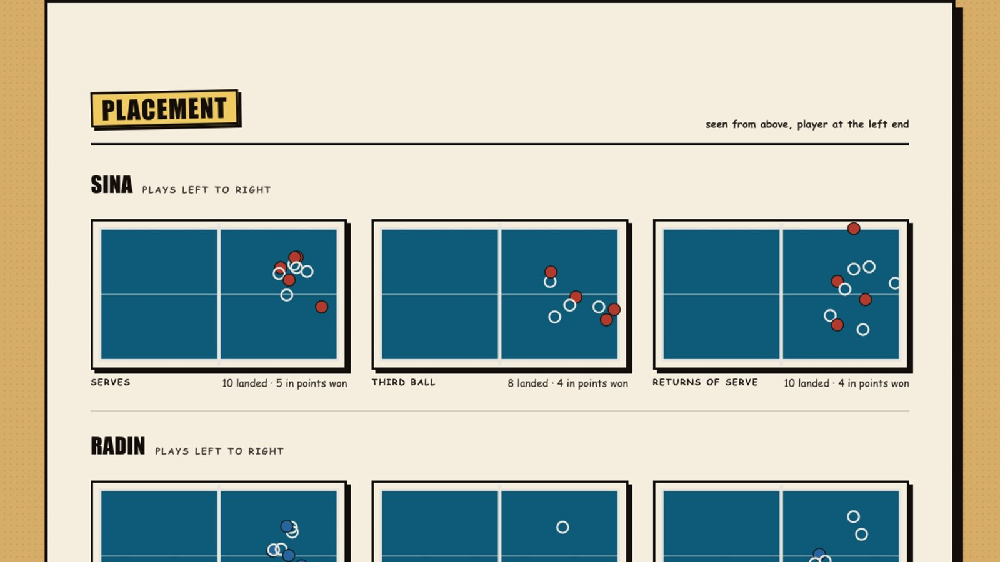<br><sub>Placement of serves, third balls and returns.</sub></td>
    <td>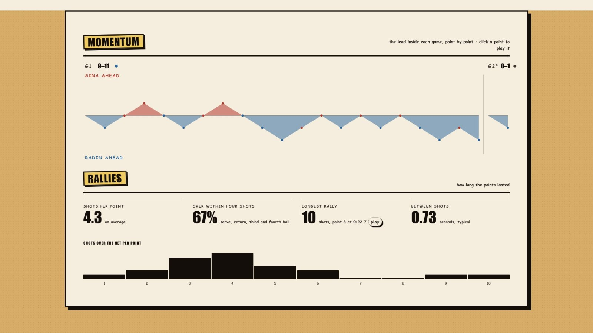<br><sub>Momentum point by point, and how long the rallies were.</sub></td>
  </tr>
  <tr>
    <td>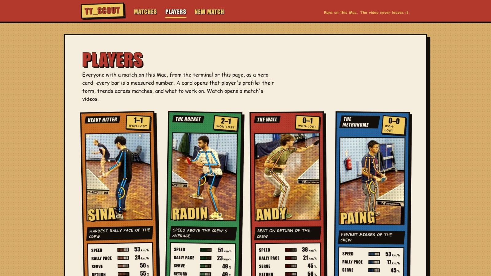<br><sub>The players page: every bar on a card is a measured number.</sub></td>
    <td>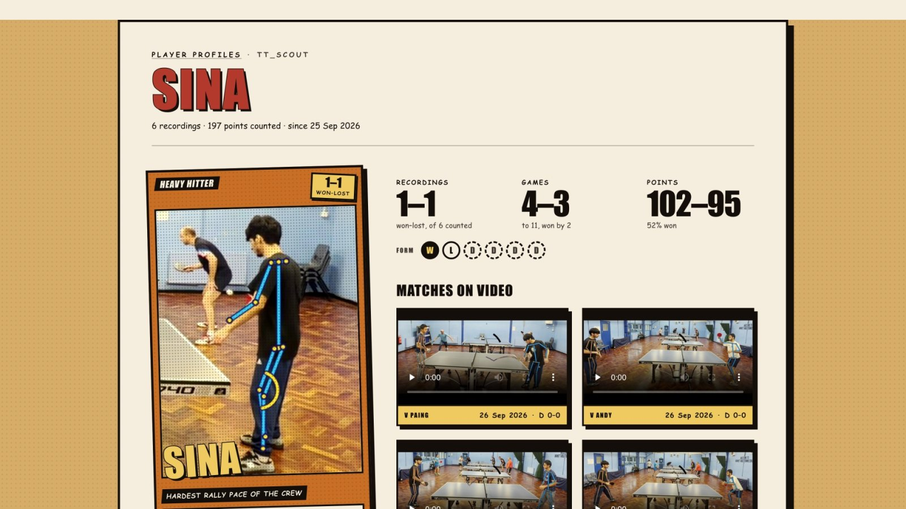<br><sub>A player's profile across recordings.</sub></td>
  </tr>
</table>

## Install

Needs Python 3.10+ and ffmpeg (`brew install ffmpeg`). The skeletons need macOS with Xcode's command line tools. Everything
else runs anywhere OpenCV does.

```bash
git clone https://github.com/Pai-88/tt-scout
cd tt-scout
python3 -m venv .venv && source .venv/bin/activate
pip install -e .
```

## Use

The upload page runs on your own machine and is only reachable from it. Drop a video in the browser, check the table corners
it found, and wait for the report:

```bash
tt-scout serve
```

Each report opens with the score, a verdict on how far the automatic count can be trusted, and every point with its clip:

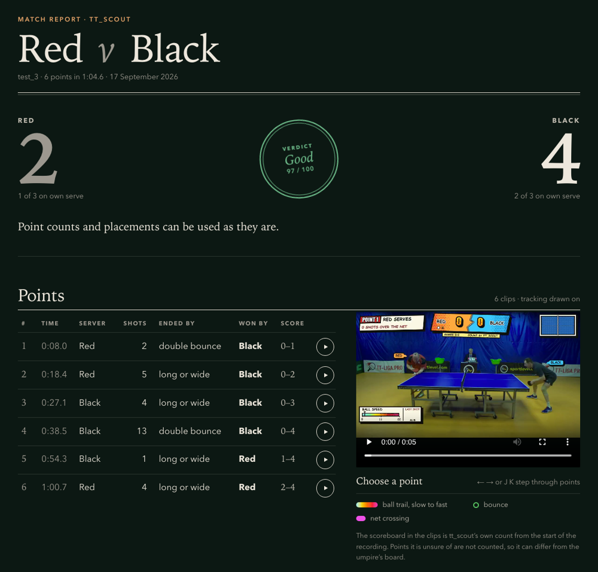

The same pipeline from the command line. It converts an iPhone HDR recording, finds the table, tracks, draws the skeletons and
builds the report:

```bash
python scripts/new_match.py IMG_1234.MOV --near Alex --far Sam
```

`--near` is the player at the left end of the picture. `tt-scout analyse match.mp4` is the quicker path for a plain .mp4
(no skeletons). If the table isn't found, click its corners with `tt-scout calibrate match.mp4`. With a learned detector you
have trained (below), `tt-scout analyse match.mp4 --detector both --model models/ballnet_phone.pt` runs it beside the classical
one.

**Filming.** Stand the phone at the side of the table, level with the net, with the whole table and both players in view,
fixed for the whole match, at 60 fps. A recording made from past the end of the table is refused before tracking starts,
because from there the nearer player hides the ball at every hit (`tt_scout/filming.py`).

## How accurate it is

| What | Result | Evidence |
|:--|:--|:--|
| Winner of each point | right on all 21 point endings that could be judged by eye in two of our recordings: 16 of 16 on one (the rules were tuned on it, so a best case) and 5 of 5 checked blind on the other | frame-by-frame hand check against the video (our recordings are not included) |
| Shot speed | every measured shot carries its own error bar, typically 4 to 5% on our recordings; on simulated shots with noise, spin and hidden racket contacts the median error is 3% | `analysis/speed_accuracy.py` |
| Speed on a real ball | not measured yet. `tt-scout droptest` compares drops from a measured height with physics (4.15 m/s from 1.00 m) | `tt_scout/droptest.py` |
| Table corners found automatically | 8 of 8 of our side-on recordings, every corner within 1.3 px of the hand-fitted one; 12 of 12 OpenTTGames clips | `analysis/check_autocal.py` on the OpenTTGames videos |
| Ball found, points, winners (professional footage) | see the figure below | 7 held-out OpenTTGames clips |
| Ball found by the learned detector on phone footage | 95 to 98% of the physics-confirmed ball positions in a hall it never trained in | `analysis/phone_ml_eval.py`, see below |

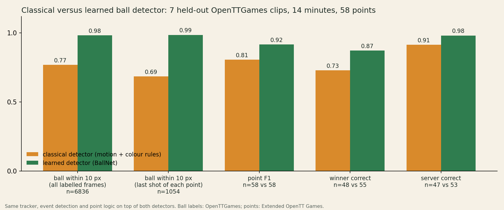

The same drawing on professional footage, one rally from an OpenTTGames league match:

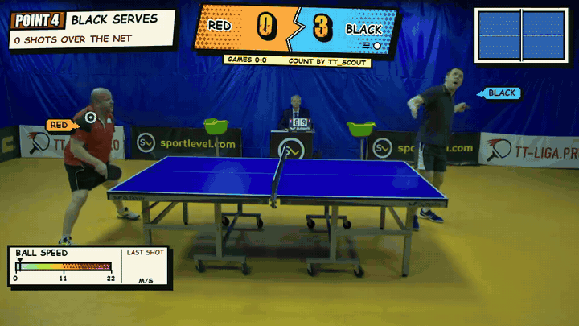

**Limits.**
- One camera sees the ball's movement towards or away from it least well. A speed whose racket contact was hidden is carried
  back from the bounce and shown as approximate (~).
- The rules can't tell a ball that clips the table edge from one that just misses.
- A second game in view is filtered out, but points from those stretches are less reliable.
- Filming from behind a player is refused rather than analysed badly.

## The learned ball detector

`tt_scout/ml/` holds BallNet, a U-Net with 1.56 million parameters. It looks at three frames at once and predicts a heatmap of
where the ball is.

**On professional footage.** Trained on the OpenTTGames training matches, it finds the ball in 98% of labelled frames on the
seven held-out clips, against 77% for the classical detector, and lifts point F1 from 0.81 to 0.92 with the rest of the pipeline
unchanged.

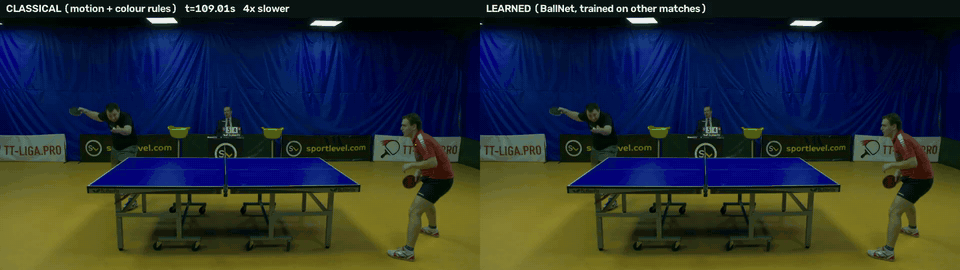

<sub>Left: the classical detector. Right: BallNet. OpenTTGames test_4, slowed 4x.</sub>

**On phone footage, with no hand labelling.** `tt_scout/ml/pseudo.py` turns a recording tt-scout has already analysed into
training data. A position from the classical tracker becomes a label only where the 3D physics fit confirms it (within 5 px of
the fitted flight, or on a smooth path from a bounce to the next hit), and dead time between points gives frames with no ball
in play. Eight of our recordings gave about 32,000 labels this way. Labels taken from the fitted flight alone, in frames the
tracker missed, were checked by eye and dropped: most were tens of pixels off the ball.

We trained on five recordings from one hall, chose the epoch and threshold on a sixth, and tested on two recordings from
another hall on another day, which no model saw:

**Short match, 21 points**

| The ball is found by | Labelled balls the network found | Shots with a measured speed | Hand-checked endings right |
|:--|:-:|:-:|:-:|
| Classical tracker alone | | 86 | 16 of 16 |
| Tracker + network trained on our recordings only | 98.1% | 93 | 16 of 16 |
| Tracker + OpenTTGames weights, fine-tuned on ours | 98.9% | 92 | 16 of 16 |
| Tracker + OpenTTGames weights as they are | 99.4% | 91 | 15 of 16 |

**Long match, 87 points**

| The ball is found by | Labelled balls the network found | Shots with a measured speed | Hand-checked endings right |
|:--|:-:|:-:|:-:|
| Classical tracker alone | | 388 | 5 of 6 |
| Tracker + network trained on our recordings only | 95.1% | 443 | 4 of 6 |
| Tracker + OpenTTGames weights, fine-tuned on ours | 96.1% | 449 | 5 of 6 |
| Tracker + OpenTTGames weights as they are | 96.8% | 509 | 5 of 6 |

The rows with a network are `--detector both`: the tracker and the network together.

"Labelled balls found" measures agreement with the physics-confirmed tracker labels, not truth. Where the two disagree, the
frames checked by eye mostly favour the network: it is on the ball while the tracker sits on an arm, a hip or a shoe. With the
network, more shots get a measured speed. The point rules, though, were tuned on the classical tracker, which goes quiet when a
point ends; the network keeps seeing the ball after the point is over, and on the longer match that moved some endings. So the
reports still default to the classical tracker, and the learned detector is an option (`--detector learned` or `both`).

<table>
  <tr>
    <td width="50%">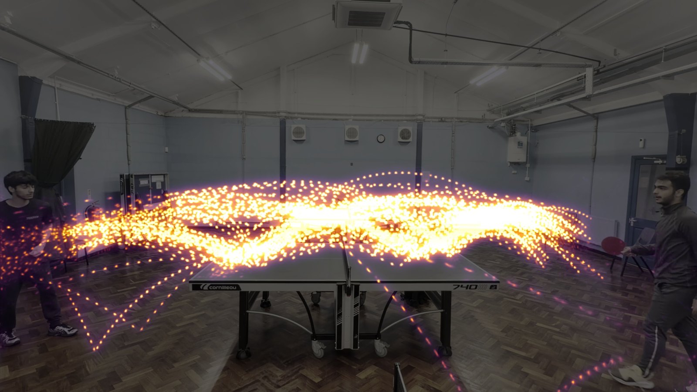<br><sub>Every ball the network found in one 61-shot rally, in the hall it never trained in.</sub></td>
    <td width="50%">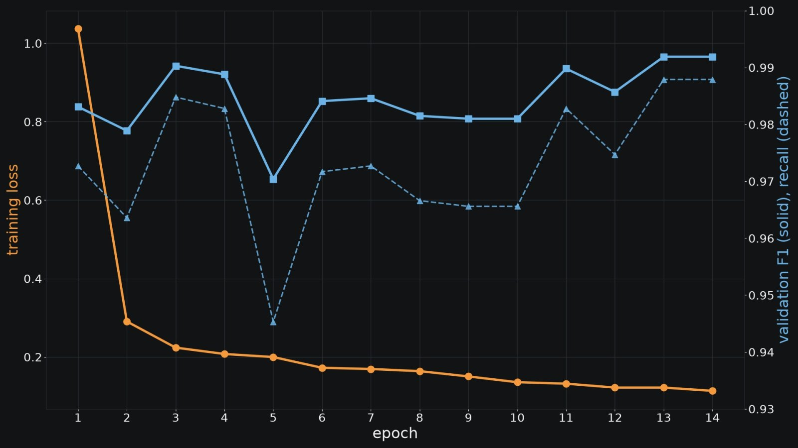<br><sub>Training on our recordings: loss, and F1 and recall on the held-back recording.</sub></td>
  </tr>
</table>

No weights are included. Weights trained on the OpenTTGames labels, or started from them, are research-only (see
`DATA_LICENSE.md`); weights trained from scratch on your own recordings carry no such restriction. To train on your own:

```bash
pip install -e ".[ml]"
python -m tt_scout.ml.pseudo out/match_a --video match_a.mp4 --table match_a_table.json --pose match_a_pose.csv --game phone_a
python -m tt_scout.ml.train --train phone_a phone_b --val phone_c --fps 60 --stride 1 --out models/ballnet_phone.pt
python analysis/phone_ml_eval.py out/match_d --video match_d.mp4 --table match_d_table.json --game phone_d --ckpt models/ballnet_phone.pt
```

To train on OpenTTGames instead, download it and run `python -m tt_scout.ml.train`.

## Reproducing the numbers

```bash
python -m unittest discover -s tests -t .         # the test suite, no footage needed (about 3 minutes)
python synth/check_pipeline.py                    # synthetic matches with known ball physics (about 6 minutes)
python analysis/speed_accuracy.py                 # simulated shots through a calibrated camera (about 3 minutes)
python openttgames.py data/test_2                 # after downloading OpenTTGames test_2: table + truth
python eval_openttgames.py data/test_2            # score the tracker against its labels
```

## What is where

| Path | What it holds |
|:--|:--|
| `tt_scout/` | the package: calibration, tracking, events and points, 3D flight fit, bodies, clips, report, website |
| `tt_scout/ml/` | the learned ball detector: model, training, labels from physics, inference |
| `tools/` | the two Swift programs that read skeletons with Apple's Vision framework |
| `scripts/` | one recording from phone file to report (`new_match.py`) and helpers |
| `analysis/` | the checks and figures behind the numbers in this README |
| `synth/` | synthetic matches with known ball physics |
| `tests/` | the test suite |
| `data/`, `labels/`, `results/` | table calibrations, truth and metrics for the OpenTTGames clips (see `DATA_LICENSE.md`) |
| `openttgames.py`, `eval_openttgames.py`, `eval_points.py` | convert an OpenTTGames clip and score tt-scout against its labels |
| `calibrate_table.py`, `label_events.py`, `label_points.py` | click table corners and label events or points by hand |

## Privacy

Recordings of people are personal data. The `.gitignore` keeps footage, reports, player profiles and training frames out of
git. The pictures and clips in `docs/media/own/` come from our own recordings, and everyone in them agreed to be shown here.
The upload page only answers requests from the machine it runs on.

## Licence

The code is MIT (`LICENSE`). Files derived from the OpenTTGames and Extended OpenTT Games datasets are CC BY-NC-SA 4.0 and are
listed in `DATA_LICENSE.md`, with the citations. The pictures and clips in `docs/media/own/` show real people and are not
licensed for reuse.
